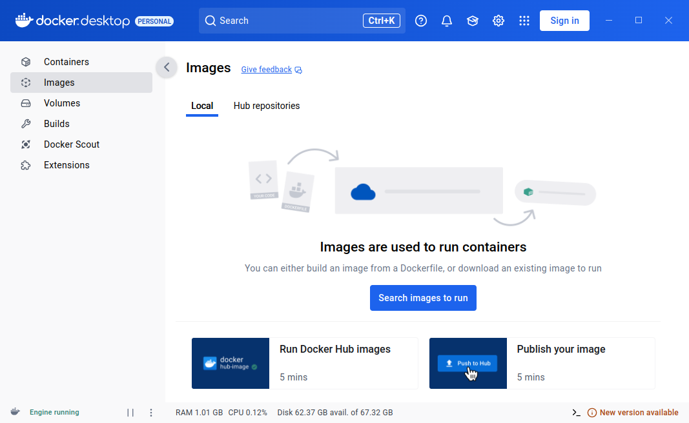
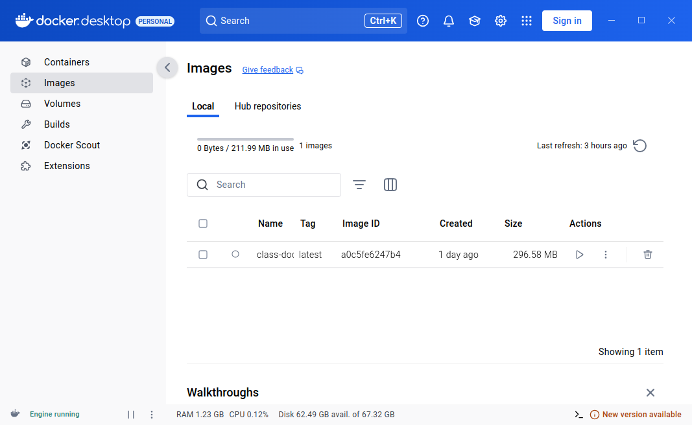
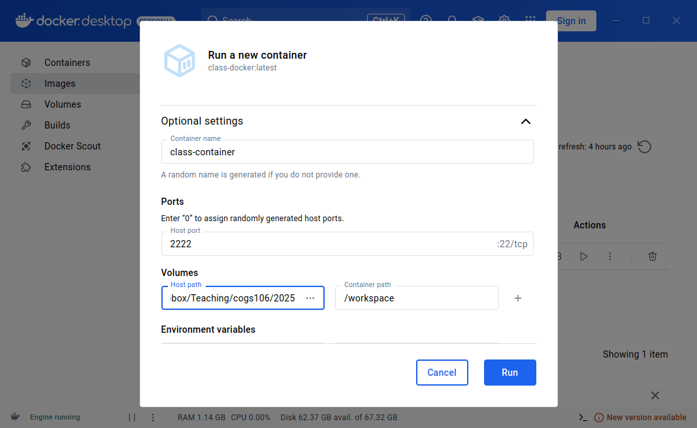
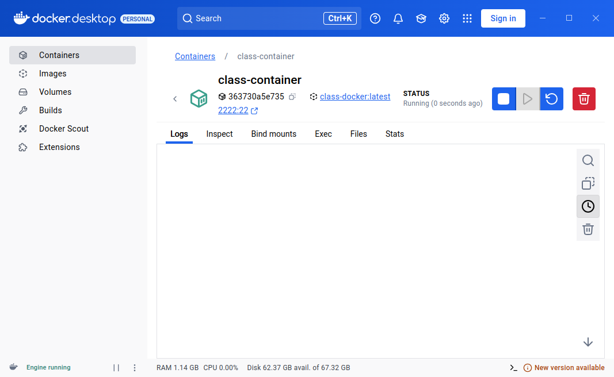
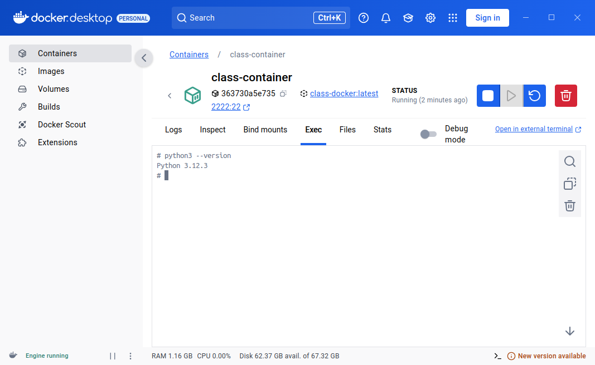

# Contents

- Introduction to containerization
- **Start the class Docker container**
- Connect with VSCode
- What are SSH keys?

---

# Start the class Docker container

This guide will help you build, run, and test the class Docker container using Docker Desktop. The container is designed to provide a consistent Python environment for our classwork.

---

# Prerequisites

Before you begin, make sure you have:

1. **Docker Desktop** installed on your computer.
   - Download it from [Docker Desktop](https://www.docker.com/products/docker-desktop).
   - Follow the installation instructions for your operating system.

---

# Prerequisites

Open Docker Desktop and navigate to the "Images" tab:



---

# Prerequisites

2. **The Dockerfile** provided for the class.

Save this in a file named `Dockerfile`:

```dockerfile
   FROM ubuntu:24.04
   ENV DEBIAN_FRONTEND=noninteractive
   RUN apt-get update && apt-get install -y \
       --no-install-recommends \
       python3=3.12.3-0ubuntu2 \
       python3-pip=24.0+dfsg-1ubuntu1.1 \
       bash=5.2.21-2ubuntu4 \
       openssh-server=1:9.6p1-3ubuntu13.5
   RUN mkdir /var/run/sshd && \
       echo 'root:rootpassword' | chpasswd
   EXPOSE 22
   CMD ["/usr/sbin/sshd", "-D"]
```

---

# Step 1: Build the Docker image

1. **Open a terminal**:
   - Navigate to the directory where your `Dockerfile` is saved.

2. **Run the build command**:
   - Use the terminal to build the image:

```bash
     docker build -t class-docker .
```

---

# Step 1: Build the Docker image

3. **Verify the image**:
   - In the "Images" tab, check that `class-docker` is listed.



---

# Step 2: Run the Docker Container

1. **Launch the container** from Docker Desktop:
   - Go to the "Images" tab.
   - Click the play icon next to the `class-docker` image.
   - Set the following options:
     - **Name**: `class-container`
     - **Ports**: Map "Container port" `22` to "Host port" `2222`.
     - **Volumes**: In "Host path," enter the directory that you want to share with the container.  In "Container path," enter `/workspace`

Setting a Volume is important because only files stored in that directory will survive if the container is destroyed!

---

# Step 2: Run the Docker Container



---

# Step 2: Run the Docker Container

2. Alternatively, you can **use the terminal** to run the container:

```bash
   docker run -dit \
       --name class-container \
       --publish 2222:22 \
       --volume /home/user/cogs106:/workspace \
       class-docker
```
(But don't do this now, use Docker Desktop.)

3. **Verify the container is running**:
   - In Docker Desktop, check that the `class-container` status shows as "Running."

   - Or, use the terminal:

```bash
     docker ps
```

---



---

# Step 3: Test the container

### Access the container

1. Use Docker Desktop’s integrated shell, and test the Python installation:

```bash
   python3 --version
```



---

# Step 3: Test the container

The integrated shell is running on the Ubuntu/Linux operating system inside the container.  You can learn the basic commands of the command line interface from the cheat sheet on GitHub.

2. Alternatively, open your system's terminal to connect to the container:
 
  ```bash
   docker exec -it class-container bash
   ```


---

# When you're done: Stop (and later restart) the container

In Docker Desktop, click the stop or play button in the Containers tab.

Or, in the terminal:

- To stop the container:

  ```bash
  docker stop class-container
  ```

- To restart the container:
 
  ```bash
  docker start class-container
  ```

---

# Summary

You’ve now set up the class Docker container, confirmed it works, and learned how to manage it using Docker Desktop. This container will be your consistent Python environment for all class activities.

In the future, you could make new containers for new projects and manage them in Docker Desktop or submit them to Docker Hub.


